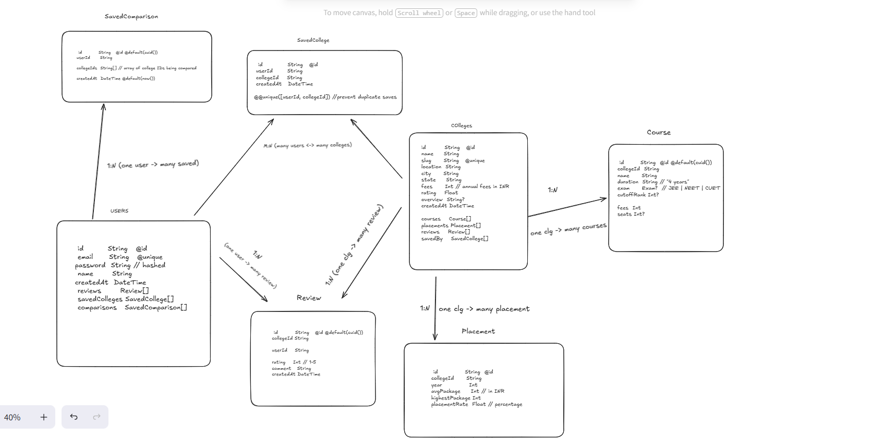

# College Discovery API


A backend API for the **College Discovery Portal** built with **Next.js (App Router)**, **TypeScript**, **Prisma**, and **PostgreSQL**. The application offers endpoint validation using **Zod**, and custom route-guard security via Next.js middleware.

---

## 🔒 Authentication & Headers

Protected routes require user authentication. The authentication middleware looks for:
1. A Bearer Token in the `Authorization` header: `Bearer <token>`
2. Or an `auth_token` cookie.

When verified, the middleware forwards the request with the following custom headers injected:
- `x-user-id`
- `x-user-email`
- `x-user-name`

---

## 🚀 API Endpoints

### 🔑 Authentication

#### `POST /api/auth/signup`
- **Description:** Registers a new user.
- **Validation:** 
  - `email`: Valid email format.
  - `password`: Minimum 6 characters.
  - `name`: Minimum 3 characters.
- **Request Body:**
  ```json
  {
    "email": "user@example.com",
    "password": "password123",
    "name": "Jane Doe"
  }
  ```
- **Success Response (201 Created):**
  ```json
  {
    "message": "User signup successfull!! please login now...",
    "user": {
      "id": "cmtehtb3i0000kkv1yc4qmv2f",
      "name": "Jane Doe",
      "email": "user@example.com"
    }
  }
  ```

#### `POST /api/auth/login`
- **Description:** Authenticates a user and returns a JWT access token.
- **Validation:**
  - `email`: Valid email format.
  - `password`: Minimum 6 characters.
- **Request Body:**
  ```json
  {
    "email": "user@example.com",
    "password": "password123"
  }
  ```
- **Success Response (200 OK):**
  ```json
  {
    "message": "Login successful",
    "user": {
      "id": "cmtehtb3i0000kkv1yc4qmv2f",
      "name": "Jane Doe",
      "email": "user@example.com"
    },
    "token": "eyJhbGciOiJIUzI1NiIsInR5cCI6IkpXVCJ9..."
  }
  ```

---

### 🎓 Colleges

#### `GET /api/colleges`
- **Description:** Retrieves a paginated and filtered list of colleges.
- **Query Parameters:**
  - `q` (string, optional): Search by name.
  - `city` (string, optional): Filter by city.
  - `minFees` / `maxFees` (integer, optional): Annual fee ranges.
  - `page` / `limit` (integer, optional, default: page=1, limit=10).
- **Success Response (200 OK):**
  ```json
  {
    "data": [
      {
        "id": "cmtddgp180000wwv1x47bpioz",
        "name": "Indian Institute of Technology Bombay",
        "slug": "iit-bombay",
        "location": "Powai, Mumbai",
        "city": "Mumbai",
        "state": "Maharashtra",
        "fees": 900000,
        "rating": 4.8,
        "overview": "Premier engineering institute...",
        "createdAt": "2026-08-28T19:56:12.092Z"
      }
    ],
    "pagination": {
      "page": 1,
      "limit": 10,
      "total": 21,
      "totalPages": 3
    }
  }
  ```

#### `GET /api/colleges/[slug]`
- **Description:** Fetches full details for a college by its unique slug.
- **Success Response (200 OK):**
  ```json
  {
    "data": {
      "id": "cmtddgp180000wwv1x47bpioz",
      "name": "Indian Institute of Technology Bombay",
      "slug": "iit-bombay",
      "location": "Powai, Mumbai",
      "fees": 900000,
      "rating": 4.8,
      "courses": [...],
      "placements": [...],
      "reviews": [...]
    }
  }
  ```

#### `GET /api/colleges/compare`
- **Description:** Performs a side-by-side comparison between 2 to 4 colleges.
- **Validation:**
  - `ids` query parameter is required (comma-separated IDs), min: 2, max: 4.
- **Success Response (200 OK):**
  ```json
  {
    "data": [
      {
        "id": "cmtddgp180000wwv1x47bpioz",
        "name": "IIT Bombay",
        "fees": 900000,
        "rating": 4.8,
        "courseCount": 3,
        "topCourses": ["B.Tech Computer Science"],
        "latestPlacement": {
          "year": 2024,
          "avgPackage": 2400000
        }
      }
    ]
  }
  ```

#### `GET /api/colleges/recommend`
- **Description:** Recommends colleges based on cutoff ranks and exams.
- **Validation:**
  - `exam`: Must be JEE, NEET, CET, or CUET.
  - `rank`: Cutoff rank matching (positive integer).
- **Success Response (200 OK):**
  ```json
  {
    "message": "Recommended colleges fetched successfully",
    "data": [
      {
        "id": "cmtddgp180000wwv1x47bpioz",
        "name": "IIT Bombay",
        "matchingCourses": [...],
        "latestPlacement": {...}
      }
    ]
  }
  ```

---

### ⭐ Reviews

#### `POST /api/colleges/reviews`
- **Description:** Submits a review on a college and dynamically updates the college's overall average rating (Requires Authentication).
- **Validation:**
  - `collegeId`: Required non-empty string.
  - `rating`: Integer between 1 and 5.
  - `comment`: String between 3 and 1000 characters.
- **Request Body:**
  ```json
  {
    "collegeId": "cmtddgp180000wwv1x47bpioz",
    "rating": 5,
    "comment": "Excellent research facilities and top-tier faculty!"
  }
  ```
- **Success Response (201 Created):**
  ```json
  {
    "message": "Review submitted successfully",
    "data": {
      "id": "cmtehtk0s0001kkv1rcdl9j48",
      "collegeId": "cmtddgp180000wwv1x47bpioz",
      "userId": "cmtehtb3i0000kkv1yc4qmv2f",
      "rating": 5,
      "comment": "Excellent research facilities and top-tier faculty!",
      "user": {
        "id": "cmtehtb3i0000kkv1yc4qmv2f",
        "name": "Jane Doe",
        "email": "user@example.com"
      }
    }
  }
  ```

#### `GET /api/colleges/reviews`
- **Description:** Lists college reviews. Optional filtering by `collegeId`.
- **Success Response (200 OK):**
  ```json
  {
    "message": "Reviews fetched successfully",
    "data": [
      {
        "id": "cmtehtk0s0001kkv1rcdl9j48",
        "collegeId": "cmtddgp180000wwv1x47bpioz",
        "rating": 5,
        "comment": "Excellent research facilities...",
        "user": {
          "name": "Jane Doe",
          "email": "user@example.com"
        }
      }
    ]
  }
  ```

---

### 📌 Saved Colleges

#### `GET /api/saved/colleges`
- **Description:** Lists saved colleges for the authenticated user (Requires Authentication).
- **Success Response (200 OK):**
  ```json
  {
    "message": "List saved colleges for the user",
    "savedColleges": [...]
  }
  ```

#### `POST /api/saved/colleges`
- **Description:** Saves a college to the user's list (Requires Authentication).
- **Request Body:**
  ```json
  {
    "collegeId": "cmtddgp180000wwv1x47bpioz"
  }
  ```
- **Success Response (201 Created):**
  ```json
  {
    "message": "College with ID cmtddgp180000wwv1x47bpioz saved successfully",
    "savedCollege": {...}
  }
  ```

#### `DELETE /api/saved/colleges`
- **Description:** Removes a saved college by `id` or `collegeId` (Requires Authentication).
- **Query Parameters:**
  - `collegeId` (string, optional)
  - `id` (string, optional)
- **Success Response (200 OK):**
  ```json
  {
    "message": "College with ID cmtddgp180000wwv1x47bpioz deleted successfully"
  }
  ```

---

## 📊 Database Architecture & Live Board

### Schema Architecture


### Excalidraw Board
You can view the interactive system planning layout here:
[Shared Live Excalidraw Board](https://excalidraw.com/#json=FwkJveHFTVV6zhqlMZ9pv,EvxqcUX0YshFVygyHy1f8g)
